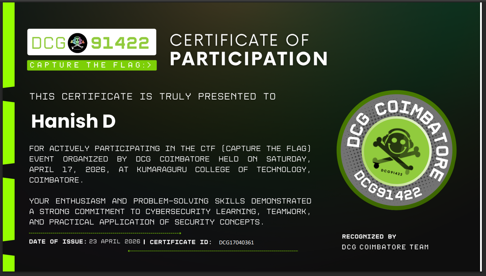
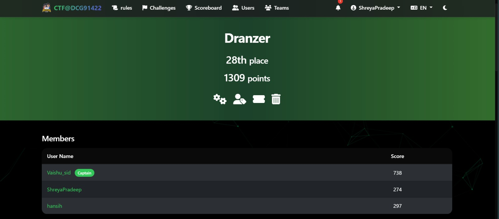
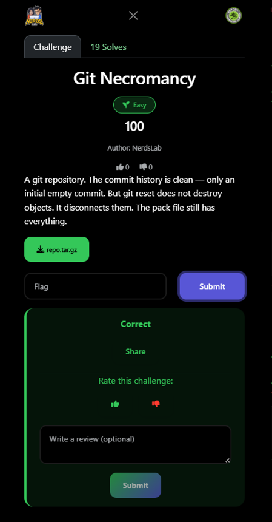
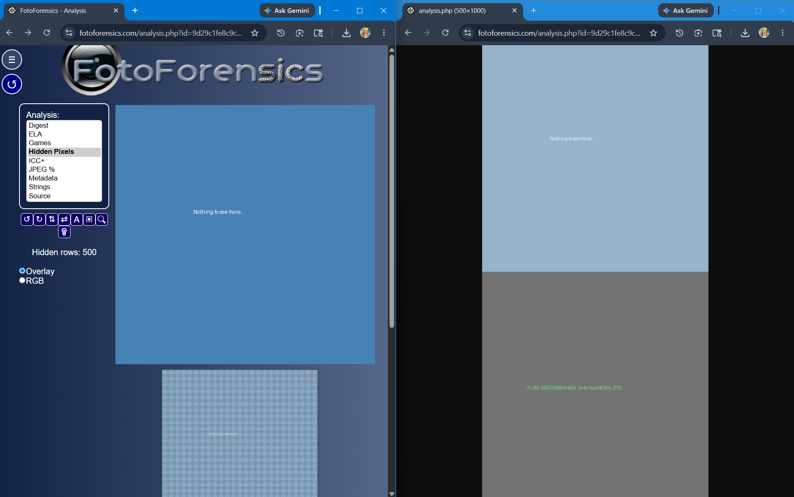
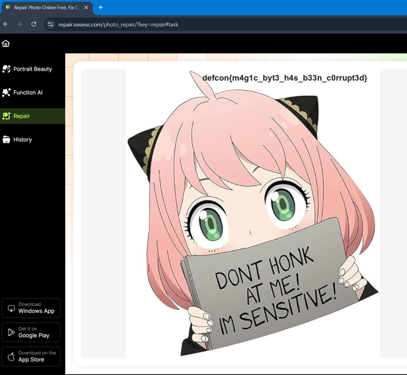
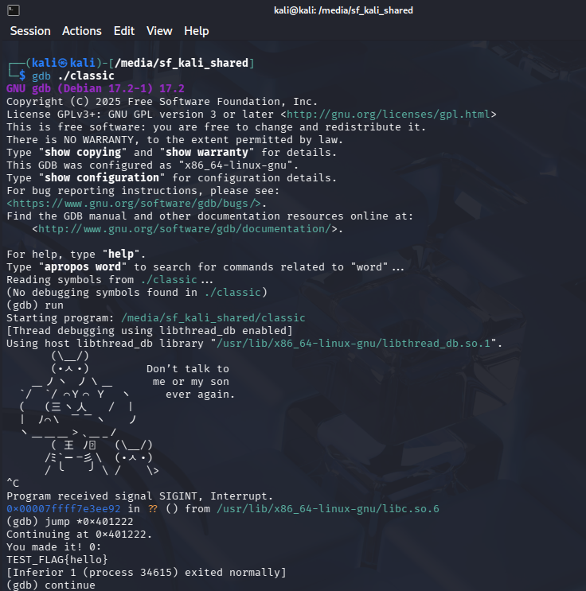

# DEFCON Coimbatore Chapter CTF

## Event Information

| Field | Details |
|---|---|
| Event | CTF@DCG91422 - DCG COIMBATORE |
| Mode | Offline @KCT |
| Team Name | Dranzer |
| Team Size | 3 Members |
| Final Standing | Top 28 |
| Score | 1309 |
| Event Policy | No LLM Assistance Allowed |

---

# Event Experience

This was my first major offline cybersecurity Capture The Flag (CTF) competition experience.

Unlike online competitions, the event enforced a strict "No Large Language Model Assistance" policy, requiring all investigation, debugging, exploitation, and analysis to be performed manually using tools, documentation, and direct experimentation.

The event involved:
- Digital Forensics
- Steganography
- Reverse Engineering
- Binary Exploitation
- Git Internals
- Network Analysis
- File Recovery
- Cryptography

This competition significantly improved my independent problem-solving workflow and practical investigation methodology.



---

## Team Members

| Member | Role | Score |
|---|---|---|
| Vaishu_sid | Captain | 738 |
| ShreyaPradeep | Member | 274 |
| Hanish D | Member | 297 |

---

## Scoreboard



---

# Challenge Writeups

---

# 1. Corrupted Image Recovery

| Category | Difficulty | Status |
|---|---|---|
| Digital Forensics | Easy | Solved |

## Overview

A corrupted image file was provided as the challenge artifact.

The image could not be opened normally, indicating possible header corruption or intentional file damage.

## Investigation Process

Initial recovery attempts were performed using:
- image repair utilities,
- metadata inspection,
- and online recovery tools.

Since the image remained partially unreadable, I opened the file directly inside a text editor to inspect raw embedded data.

During manual inspection, the flag was discovered directly inside the corrupted file contents.

## Tools Used

- Notepad
- Online File Repair Utilities

## Key Learning

This challenge demonstrated that corrupted files may still contain recoverable plaintext data even when the file structure itself is damaged.

## Final Result

```text
defcon{d3l3t3d_but_n0t_g0n3_r3c0v3r3d}
```

---

# 2. Git Necromancy

| Category | Difficulty | Status |
|---|---|---|
| Git Forensics | Easy | Solved |

## Overview

The challenge provided a compressed Git repository archive containing an apparently clean commit history.

However, the challenge description hinted that Git reset operations do not permanently destroy Git objects.

## Initial Observation

After extracting the repository, the visible commit history appeared empty except for an initial commit.

The challenge description specifically referenced:
- disconnected Git objects,
- pack files,
- and repository recovery.

This suggested the flag might exist inside dangling commits or packed Git objects.

## Investigation Process

I explored multiple Git recovery techniques and tested several online Git analysis utilities, but most approaches failed to expose hidden objects.

Eventually, I manually analyzed the internal `.git` structure and discovered packed Git objects inside:

```text
.git/objects/pack/
```

The packed objects were extracted using:

```bash
git unpack-objects < .git\objects\pack\pack-xxxxxxxx.pack
```

After unpacking the objects, repository integrity checks were performed using:

```bash
git fsck --lost-found
```

This revealed a dangling commit:

```text
a93585887246672d81679c548f11e1a33fc17788
```

The commit contents were then inspected using:

```bash
git show a9358588
```

This exposed a previously deleted backup file containing the flag.

## Tools Used

- Git
- Windows Command Prompt
- Gource
- Git Internals
- Manual Repository Analysis

## Key Learning

This challenge demonstrated how Git history rewriting and reset operations do not immediately destroy repository objects, making deleted commits recoverable through low-level Git analysis.

## Final Result

```text
defcon{d3l3t3d_c0mm1t_r3c0v3r3d_fr0m_p4ck}
```



---

# 3. Hidden Pixel Manipulation Challenge

| Category | Difficulty | Status |
|---|---|---|
| Steganography | Easy | Solved |

## Overview

The challenge provided an image displaying only:

```text
Nothing to see here...
```

The image appeared visually empty during normal viewing.

## Investigation Process

I suspected hidden pixel manipulation or embedded steganographic content.

Multiple online image analysis tools were tested, including:
- image enhancement,
- hidden pixel extraction,
- and contrast analysis utilities.

Several tools produced blurry outlines indicating hidden embedded text, but the flag remained unreadable.

Eventually, I discovered the online forensic analysis platform:

```text
FotoForensics
```

Using hidden pixel and image error analysis techniques, the concealed flag became visible.

## Tools Used

- FotoForensics
- Online Steganography Tools
- Image Contrast Analysis

## Key Learning

This challenge demonstrated how image manipulation techniques can hide visual information inside pixel-level modifications that are invisible during normal rendering.

## Final Result

```text
DEFCON{h34d3r_m4n1pul4t10n_f72}
```


---

# 4. h3h3.jpg

| Category | Difficulty | Status |
|---|---|---|
| File Recovery | Easy | Solved |

## Overview

A corrupted JPG image file named:

```text
h3h3.jpg
```

was provided as the challenge artifact.

The image could not be opened normally.

## Investigation Process

The file was analyzed using several online image repair and corruption recovery tools.

After testing multiple repair methods, the image was successfully reconstructed using:

```text
repair.easeus.com
```

The repaired image directly contained the flag.

## Tools Used

- EaseUS Online Repair
- Image Recovery Utilities

## Key Learning

This challenge demonstrated how corrupted image headers and damaged file structures can often be repaired automatically using recovery utilities.

## Final Result

```text
defcon{m4g1c_byt3_h4s_b33n_c0rrupt3d}
```


---

# 5. classic

| Category | Difficulty | Status |
|---|---|---|
| Binary Exploitation / Reverse Engineering | Medium | Partial Solve |

## Overview

A file named:

```text
classic
```

was provided without any extension.

The file initially appeared unreadable and difficult to classify.

## Investigation Process

Using the Linux `file` command, the artifact was identified as a:

```text
64-bit ELF executable
```

Readable strings were extracted using:

```bash
strings classic
```

This revealed:
- hidden messages,
- references to a flag,
- and a suspicious hidden function named `win`.

The binary was further analyzed using GDB.

Function enumeration using:

```bash
info functions
```

revealed the hidden function:

```text
win
```

Disassembly of the `main` function revealed:
- a stack buffer,
- oversized read operations,
- and probable buffer overflow behavior.

Direct exploitation attempts triggered stack-smashing protection.

Instead of bypassing protections manually, execution flow was redirected directly into the hidden `win()` function using:

```bash
jump *0x401222
```

The function attempted to read an external file named:

```text
flag
```

This confirmed the binary itself did not contain the real flag.

A custom local flag file was created to validate the hidden functionality.

## Tools Used

- Linux
- GDB
- strings
- ELF Analysis
- Manual Disassembly

## Key Learning

This challenge provided practical exposure to:
- ELF binary analysis,
- hidden function discovery,
- debugger-assisted execution control,
- and buffer overflow investigation workflows.



## Final Status

The hidden execution path was successfully identified, but the original challenge flag was unavailable locally.

---

# 6. whatisthis.png

| Category | Difficulty | Status |
|---|---|---|
| Cryptography / Encoding | Medium | Unsolved |

## Overview

The challenge provided a symbol-based encoded image containing unknown geometric characters.

## Investigation Process

The symbols appeared visually similar to:
- symbolic ciphers,
- custom alphabets,
- or encoded substitution systems.

I attempted:
- Morse code interpretation,
- online symbol decoders,
- and pattern comparison techniques.

However, the encoding system could not be fully identified during the event.

## Tools Used

- Online Cipher Tools
- Manual Pattern Analysis

## Key Learning

This challenge reinforced the importance of identifying the correct encoding family before attempting brute-force decoding methods.

## Final Status

The encoding scheme was not successfully identified.

---

# 7. Encoded Text Blob Challenge

| Category | Difficulty | Status |
|---|---|---|
| Cryptography | Hard | Unsolved |

## Overview

The challenge provided a large encoded text blob beginning with:

```text
LSpELCE8V1h5YyFieFVhZFQ5...
```

The structure strongly resembled Base64-encoded data.

## Investigation Process

I tested multiple decoding workflows using CyberChef and manual transformation techniques including:
- Base64 decoding,
- Magic analysis,
- decompression attempts,
- and layered encoding detection.

Despite extensive testing, the correct decoding sequence was not identified during the event.

## Tools Used

- CyberChef
- Base64 Analysis
- Encoding Detection Utilities

## Key Learning

This challenge demonstrated how layered encoding challenges often require identifying the exact transformation chain rather than relying solely on automated decoding tools.

## Final Status

The final decoding chain was not identified.

---

# 8. PCAP Traffic Analysis Challenge

| Category | Difficulty | Status |
|---|---|---|
| Network Forensics | Hard | Unsolved |

## Overview

The challenge provided a PCAP network capture file for forensic traffic analysis.

## Investigation Process

The packet capture was inspected using:
- Wireshark,
- online PCAP analysis tools,
- and protocol inspection methods.

However, due to the challenge complexity and my beginner-level network forensic experience at the time, the hidden data stream could not be isolated successfully.

## Tools Used

- Wireshark
- Online PCAP Analysis Utilities

## Key Learning

This challenge highlighted the importance of protocol familiarity and filtering methodology during network forensic investigations.

## Final Status

The hidden payload was not recovered.

---

# 9. ghost_main.exe

| Category | Difficulty | Status |
|---|---|---|
| Reverse Engineering | Hard | Unsolved |

## Overview

A Windows executable named:

```text
ghost_main.exe
```

was provided for reverse engineering analysis.

## Investigation Process

Initial investigation attempts focused on:
- online malware analysis platforms,
- executable inspection,
- and automated analysis utilities.

However, due to limited reverse engineering experience at the time, the executable behavior and intended analysis path could not be determined.

## Tools Used

- Online Binary Analysis Platforms

## Key Learning

This challenge highlighted the complexity of Windows executable reverse engineering and demonstrated the importance of understanding PE structures and runtime behavior analysis.

## Final Status

The executable functionality was not fully analyzed during the event.