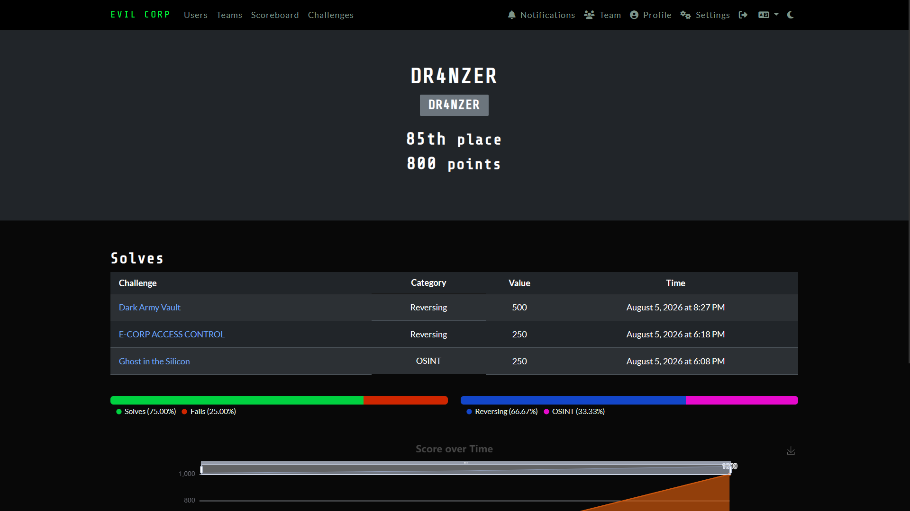
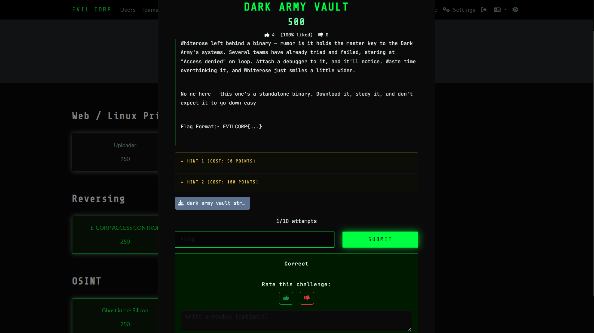
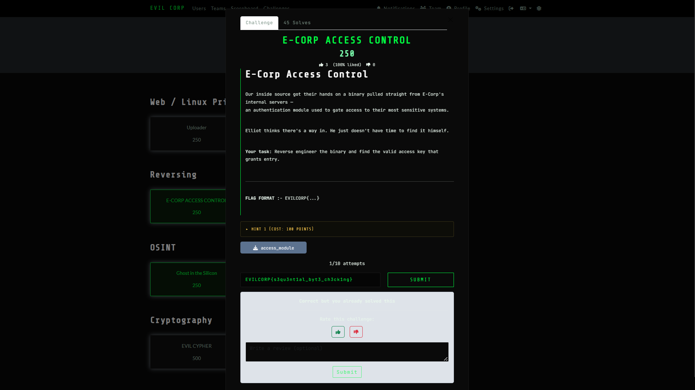
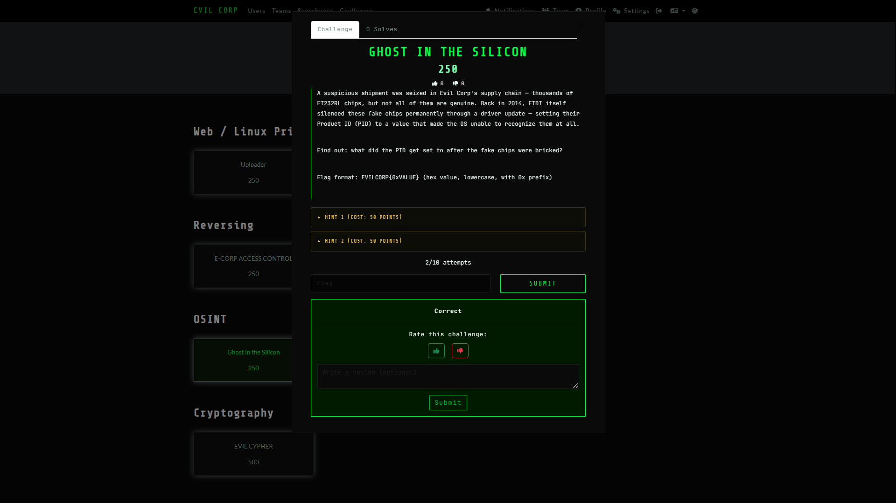

# EVILCORP CTF 2026

## Event Information

| Field | Details |
|---|---|
| Event | EVILCORP CTF |
| Date | 5 August 2026 |
| Mode | Online |
| Team Name | Dranzer |
| Institution | KGiSL Institute of Technology |
| Duration | Scheduled for 6 Hours (Ended Early) |
| Team Size | 4 Members |

---

---

## Scoreboard



---

# Event Summary

EVILCORP CTF was an online Jeopardy-style Capture The Flag competition covering multiple cybersecurity domains including:

- Reverse Engineering
- Privilege Escalation
- Cryptography
- Open Source Intelligence (OSINT)

Due to an issue affecting the competition infrastructure, the event concluded at **10:00 PM** instead of the scheduled **12:00 AM**.

During the competition, I successfully solved **three challenges**, primarily focused on reverse engineering and OSINT.

---

# Challenge Writeups

---

# 1. Dark Army Vault

| Category | Difficulty | Status |
|---|---|---|
| Reverse Engineering | 500 Points | Solved |

## Overview

The challenge provided a stripped ELF binary named:

```text
dark_army_vault_stripped
```



The binary implemented anti-debugging techniques and validated a hidden input before granting access to the vault.

## Investigation Process

I began by reversing the stripped binary using **Dogbolt**, allowing me to compare decompiler outputs and understand the program structure.

From the recovered pseudocode, I identified several indicators suggesting:

- anti-debugging using `ptrace`
- timing-based checks
- custom bytecode execution
- per-character validation

After researching the observed behaviour and discussing the reversing approach with Claude, I confirmed that the binary implemented a small virtual machine (VM) which transformed each input character before comparing it against embedded constants.

The transformation was reversed by applying the inverse operation to every constant.

## Tools Used

- Notepad
- Dogbolt
- ELF Analysis
- Claude (research assistance)

## Key Learning

This challenge introduced me to:

- VM-based flag checkers
- anti-debugging techniques
- bytecode interpretation
- reverse transformation of validation algorithms

## Research Conclusion

The binary used a bytecode virtual machine where each character was transformed as:

```
input XOR 42
Rotate Left by 3 bits
Compare against constant
```

Reversing the operation produced:

```
input = ROR3(constant) XOR 42
```

allowing the original flag to be reconstructed.

## Final Result

```text
EVILCORP{gh0st_1n_th3_v4ult_st4y_p4r4n01d}
```

---

# 2. E-Corp Access Control

| Category | Difficulty | Status |
|---|---|---|
| Reverse Engineering | 250 Points | Solved |

## Overview

The challenge provided an authentication binary named:

```text
access_module
```



The objective was to recover the correct access key accepted by the validation routine.

## Investigation Process

Using Dogbolt, I inspected the decompiled source code and identified a sequential byte validation routine.

Further research with Gemini helped explain the verification algorithm and the rolling-key mechanism used during comparison.

Based on the recovered logic, I implemented a Python script to reverse the validation algorithm and reconstruct the original access key.

## Tools Used

- Notepad
- Dogbolt
- Python
- Gemini (research assistance)

## Key Learning

This challenge improved my understanding of:

- rolling XOR algorithms
- sequential byte verification
- reversing validation routines
- translating decompiled logic into Python

## Final Result

```text
EVILCORP{s3qu3nt1al_byt3_ch3ck1ng}
```

---

# 3. Counterfeit FT232RL Chips

| Category | Difficulty | Status |
|---|---|---|
| OSINT | 250 Points | Solved |



## Overview

The challenge referenced the 2014 FTDI counterfeit chip incident and required identifying the Product ID assigned to fake FT232RL chips after they were intentionally disabled.

## Investigation Process

I researched the historical FTDI driver update using public sources and verified the technical details with Gemini.

The investigation confirmed that the Windows driver modified counterfeit chips by overwriting their USB Product ID.

## Tools Used

- Google Search
- Gemini

## Key Learning

This challenge highlighted the importance of historical cybersecurity incidents and demonstrated how hardware security events can become valuable OSINT topics.

## Research Conclusion

During the 2014 FTDI driver controversy, counterfeit FT232RL chips had their Product ID changed from:

```text
0x6001
```

to

```text
0x0000
```

preventing operating systems from recognizing the device.

## Final Result

```text
EVILCORP{0x0000}
```

---

# Skills Practiced

Throughout this event I gained practical exposure to:

- ELF reverse engineering
- Anti-debugging analysis
- Virtual machine (VM) based validation
- Rolling XOR algorithms
- Decompiled code interpretation
- Python-assisted reverse engineering
- Historical cybersecurity OSINT research

---

# Reflection

This competition reinforced that reverse engineering is not only about understanding assembly or decompiled code, but also about researching unfamiliar techniques, validating assumptions, and systematically reversing custom verification logic. It also emphasized the importance of combining static analysis with scripting to automate repetitive reverse-engineering tasks.