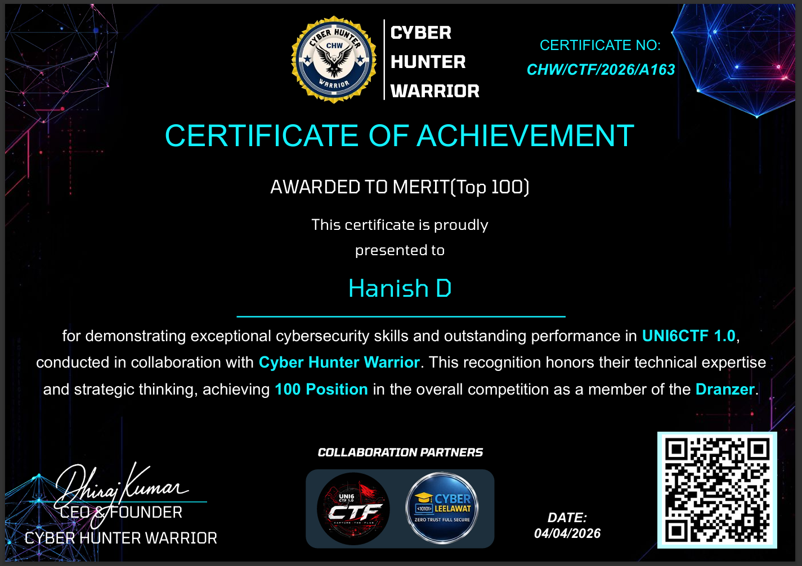
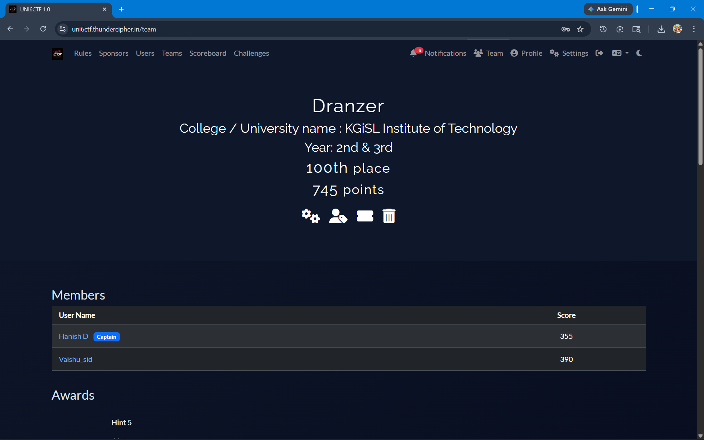
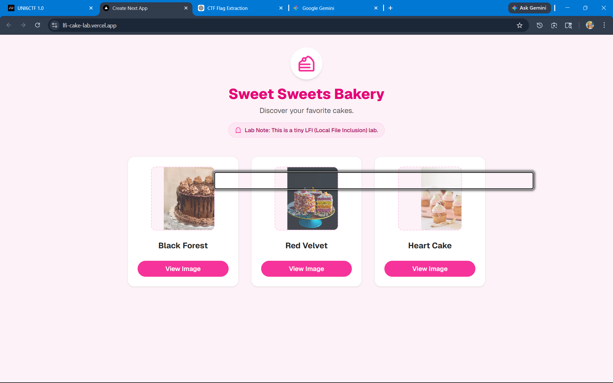
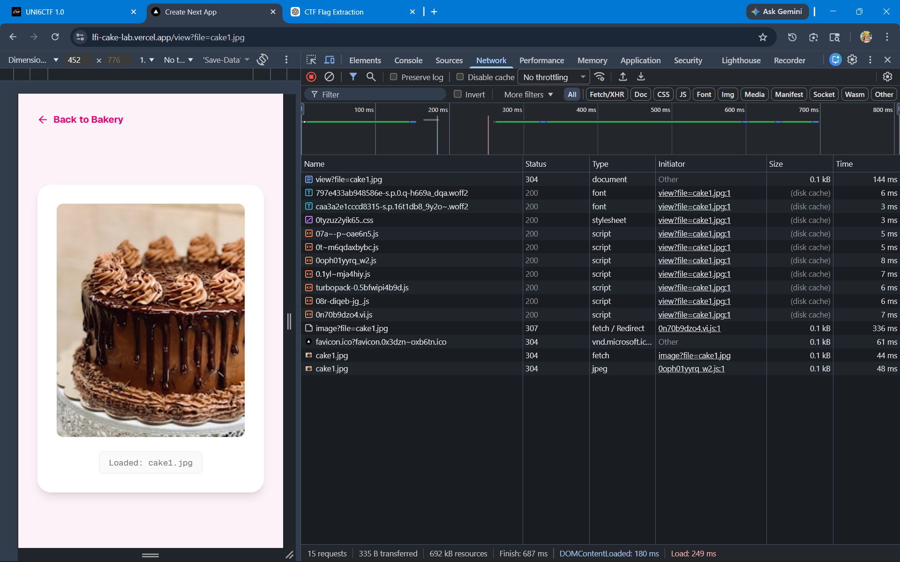
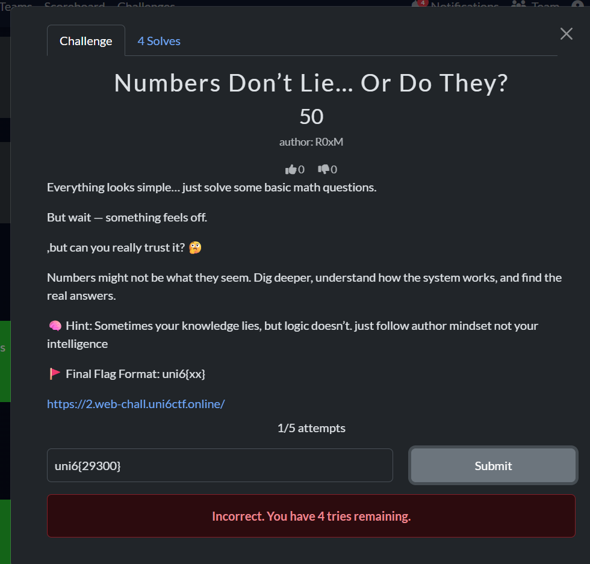
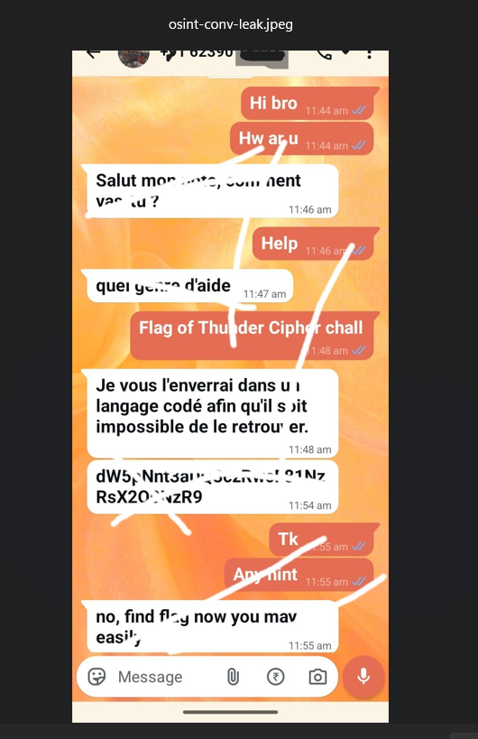
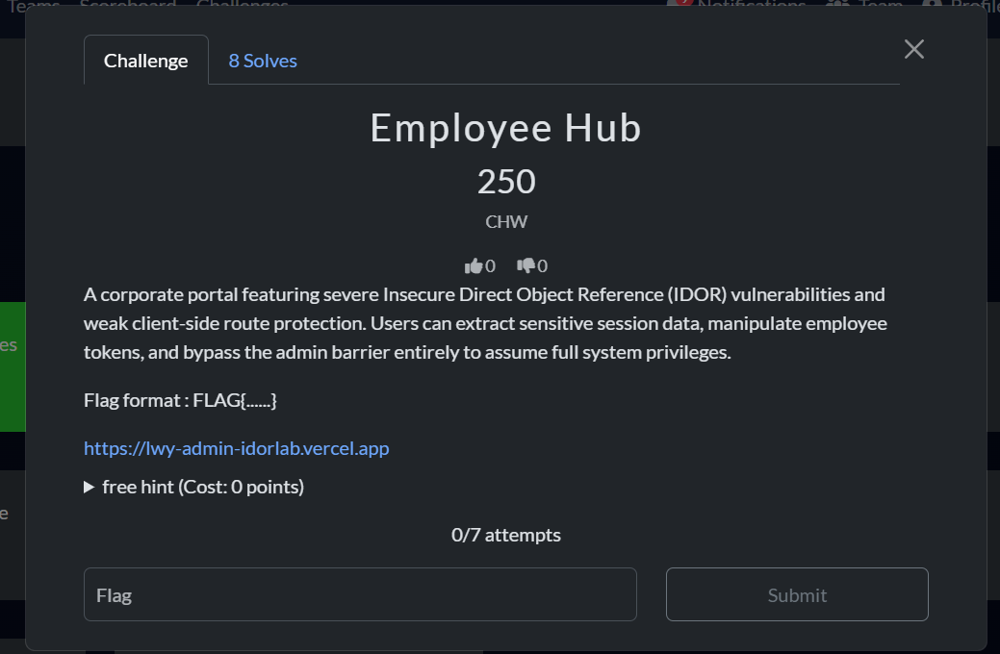
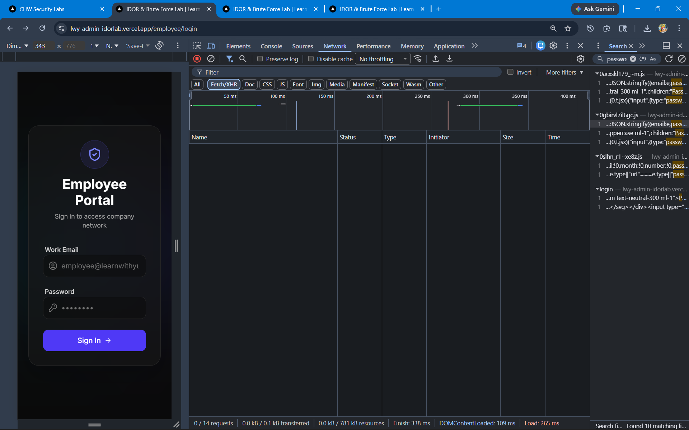

# UNI6CTF 1.0

## Event Information

| Field | Details |
|---|---|
| Event | UNI6CTF 1.0 |
| Mode | Online |
| Team Name | Dranzer |
| Institution | KGiSL Institute of Technology |
| Rank | 100 |
| Score | 745 |



---

## Team Members

| Member | Role | Score |
|---|---|---|
| Hanish D | Captain | 355 |
| Vaishu_sid | Member | 390 |

---

## Scoreboard



---

# Challenge Categories Explored

- Web Exploitation
- Cryptography
- Reverse Engineering
- Digital Forensics
- Open Source Intelligence
- Client-Side Security

---

# Challenge Writeups

---

# 1. Sweet Sweets Backery

| Category | Difficulty | Status |
|---|---|---|
| Web Exploitation | Easy | Solved |



## Overview

This challenge involved identifying and testing a Local File Inclusion (LFI) vulnerability through a dynamically loaded file parameter.

## Initial Observation

While inspecting browser network traffic using Developer Tools, image files were being loaded using a URL parameter similar to:

```text
view?file=cake1.jpg
```

This suggested the application might be directly processing user-controlled file paths.

## Investigation Process

I tested whether the application properly validated file paths before loading files from the server.

Directory traversal payloads using:

```text
../../
```

were tested to determine whether files outside the intended directory could be accessed.

I also reviewed client-side JavaScript logic to understand how file paths were being handled internally.



## Tools Used

- Browser Developer Tools
- Firefox
- Kali Linux

## Key Learning

This challenge demonstrated how insecure file-loading functionality can expose unintended server-side resources when user input is not sanitized correctly.

## Final Status

The vulnerability behavior was mapped and the final flag was recovered.

---

# 2. Numbers Don't Lie... Or Do They?

| Category | Difficulty | Status |
|---|---|---|
| Client-Side Security | Medium | Partial Solve |

## Overview

This challenge involved analyzing a browser-based calculator application that insecurely processed user input using JavaScript evaluation functions.

## Initial Observation

While exploring hidden application endpoints, I discovered a calculator page that accepted direct mathematical input.

Reviewing the JavaScript source code revealed the following logic:

```javascript
display.value = eval(display.value);
```

This indicated possible arbitrary JavaScript execution through user-controlled input.

## Investigation Process

I first tested execution using:

```javascript
alert(1)
```

After confirming JavaScript execution, I attempted:
- DOM inspection
- localStorage enumeration
- cookie inspection
- runtime object analysis

I also tested dynamic string generation using:

```javascript
String.fromCharCode()
```

Further investigation revealed that the calculator buttons were intentionally remapped internally.

Example:

```text
Input: 123456789
Processed Output: 156230471
```

This appeared to be an intentional obfuscation mechanism.



## Tools Used

- Browser Developer Tools
- JavaScript Console

## Key Learning

This challenge reinforced the risks of using eval() with user-controlled input and demonstrated why frontend validation should never be trusted for security.

## Final Status

Arbitrary JavaScript execution was achieved, but the final flag was not recovered before the event ended.

---

# 3. Learn, Learn, Learn

| Category | Difficulty | Status |
|---|---|---|
| Reverse Engineering | Medium | Partial Solve |

## Overview

This challenge presented a sequence of symbols composed of:

```text
+, -, >, <, ., [, ]
```

The symbol pattern strongly resembled the Brainfuck esoteric programming language.

## Investigation Process

I identified the challenge as Brainfuck code and used an interpreter to execute the payload.

The decoded output produced:

```text
P@55w0rd!sN0t3asy
```

However, the output did not produce the correct final flag submission, indicating the result may have been a decoy or intermediate step.

## Tools Used

- Brainfuck Interpreter
- Browser Tools

## Key Learning

This challenge demonstrated how CTF challenges sometimes include intentionally misleading outputs to encourage deeper analysis beyond the first decoded result.

## Final Status

The decoded message was recovered successfully, but the actual flag was not identified.

---

# 4. The Old Trick

| Category | Difficulty | Status |
|---|---|---|
| Cryptography | Easy | Unsolved |

## The Only Instruction Given

Turn the pages in a reversed way, I am one of the oldest ways, If you have anything confidential to say, Use me to change its way.

## Overview

This challenge contained hints referencing:
- reversal,
- old encryption methods,
- and message transformation.

## Investigation Process

I tested several classical cryptographic techniques including:
- Atbash Cipher
- Caesar Cipher
- ROT13
- text reversal
- letter extraction techniques

The wording strongly suggested historical monoalphabetic substitution methods.

## Tools Used

- CyberChef
- Manual Cipher Analysis

## Key Learning

This challenge reinforced the importance of interpreting challenge wording carefully, since small linguistic hints often indicate the intended cryptographic method.

## Final Status

Multiple classical cipher techniques were tested, but the correct flag was not identified during the event.

---

# 5. Fake People Will Help

| Category | Difficulty | Status |
|---|---|---|
| Miscellaneous / Logic | Easy | Unsolved |

## Overview

The challenge presented the phrase:

```text
fake people will help
```

The wording suggested hidden extraction logic, semantic manipulation, or intentional misdirection.

## Investigation Process

I tested multiple interpretations including:
- removing characters from the word "fake"
- first-letter extraction
- last-letter extraction
- word-length encoding
- semantic reinterpretation

I also tested common cipher methods and text transformations.

## Tools Used

- Manual Analysis
- CyberChef

## Key Learning

This challenge demonstrated the importance of rapidly testing multiple hypotheses without becoming locked into a single interpretation path.

## Final Status

The intended flag logic was not identified before the event ended.

---

# 6. Thunder Cipher — OSINT Challenge

| Category | Difficulty | Status |
|---|---|---|
| Open Source Intelligence | Hard | Partial Solve |

## Overview



This challenge involved investigating a leaked WhatsApp conversation image to identify hidden or encoded information.

## Investigation Process

The image was analyzed using:
- EXIF extraction
- raw string extraction
- Base64 decoding
- JPEG structure analysis
- LSB steganography testing
- CyberChef analysis

A Base64 string inside the conversation decoded to:

```text
uni6{winter0r_u74l_m674}
```

However, the decoded string appeared to function as a decoy or intermediate clue rather than the final flag.

Additional analysis focused on possible Zero-Width Character steganography and hidden visual patterns inside the image markup.

## Tools Used

- CyberChef
- EXIF Analysis
- String Extraction Utilities

## Key Learning

This challenge demonstrated how Open Source Intelligence and steganography challenges frequently combine misleading indicators with layered encoding techniques.

## Final Status

Multiple forensic and steganographic methods were tested, but the final hidden payload was not recovered.

---

# 7. gods_child_.wav

| Category | Difficulty | Status |
|---|---|---|
| Digital Forensics | Hard | Unsolved |

## Overview

This challenge involved investigating a WAV audio file for hidden data and steganographic payloads.

## Investigation Process

The audio file was analyzed using:
- metadata extraction,
- signature analysis,
- spectrogram analysis,
- LSB extraction attempts,
- and steganography tools.

The following tools and techniques were tested:
- ExifTool
- Binwalk
- Steghide
- StegSeek
- Audacity Spectrogram Analysis

No appended archives or plaintext payloads were discovered.

## Tools Used

- ExifTool
- Binwalk
- Audacity
- Steghide
- StegSeek

## Key Learning

This challenge provided hands-on exposure to audio steganography analysis workflows and forensic validation techniques.

## Final Status

The hidden payload was not recovered during the event.

---

# 8. Employee Hub Lab

| Category | Difficulty | Status |
|---|---|---|
| Web Security | Hard | Partial Solve |

## Overview



This challenge focused on identifying possible Insecure Direct Object Reference (IDOR) vulnerabilities inside a corporate employee portal.

## Investigation Process

The application login flow, client-side scripts, browser storage, and network traffic were inspected for:
- exposed credentials,
- insecure object references,
- hidden API endpoints,
- and weak route protections.

Direct route manipulation attempts were also tested against possible employee and admin endpoints.



## Tools Used

- Browser Developer Tools
- Network Inspector
- JavaScript Source Analysis

## Key Learning

This challenge demonstrated how IDOR testing often requires valid authenticated sessions before object reference manipulation can be performed effectively.

## Final Status

The administrative access path was not identified before event completion.

---

# 9. Operation 23

| Category | Difficulty | Status |
|---|---|---|
| Reverse Engineering / Forensics | Hard | Unsolved |

## Overview

This challenge involved decoding a heavily obfuscated Unicode payload encoded using Base16384.

## Investigation Process

The payload was decoded into binary form using a custom Python utility built with the `pybase16384` library.

The resulting binary output was analyzed using:
- file signature analysis,
- entropy analysis,
- hex inspection,
- and byte extraction techniques.

Further analysis revealed additional obfuscation layers and transposition-style encoding structures.

## Tools Used

- Python
- pybase16384
- Binwalk
- xxd
- ent

## Custom Script

To process the Base16384 encoded payload, I wrote a small Python decoding utility using the `pybase16384` library.

The script:
- converted the Unicode glyph stream into UTF-16BE bytes,
- decoded the Base16384 payload,
- attempted UTF-8 interpretation,
- and saved binary output when plaintext decoding failed.

### Script Location

```text
scripts/base16384_decoder.py
```

## Final Result

Recovered Payload:

```text
uni6{n6CnrtLin_@krYuFudteretBs656F@}
```

Yet unsolved...